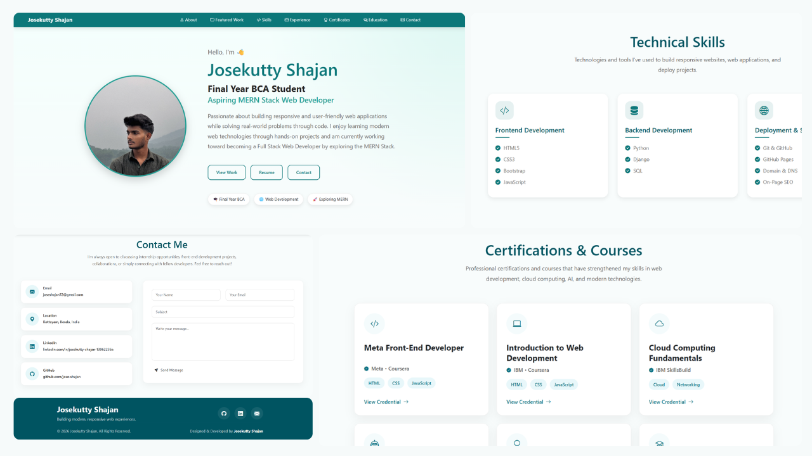

<h1 align="center">💼 Josekutty Shajan Portfolio</h1>

<p align="center">
  
</p>

A modern and responsive personal portfolio showcasing my projects, technical skills, certifications, and experience as a Front-End Developer.

## 🚀 Live Demo

🔗 https://jose-shajan.github.io/my_portfolio/

## ✨ Features

- Responsive Design
- Modern UI/UX
- Project Showcase
- Skills Section
- Experience Timeline
- Certifications
- Contact Form (EmailJS)
- Smooth Scrolling
- Back to Top Button

## 🛠 Tech Stack

- HTML5
- CSS3
- Bootstrap 5
- JavaScript
- EmailJS

## 📂 Getting Started

```bash
git clone https://github.com/jose-shajan/my_portfolio.git
```

Open `index.html` in your browser.

## 📬 Contact

- **Email:** joseshajan72@gmail.com
- **LinkedIn:** https://www.linkedin.com/in/josekutty-shajan-13962236a/
